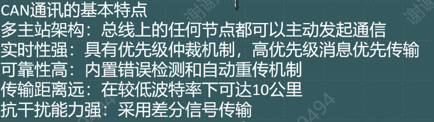

# 8.14-串口通讯

Created: 2025年8月14日 08:40

## UART

- Universal Asynchronous Receiver/Transmitter，通用异步收发传输器
- USART：多了一个synchronous→同步/异步

### 1.【类型概念】

    **① 串行通信**：UART是一种串行通信协议，数据以一位一位的形式在单根线上按顺序传输，与并行通信（数据同时在多根线上传输）相对。

- 线少/短，成本低

    **②异步通信**：UART通信是异步的，即发送方和接收方不需要共享时钟信号。每个数据帧包含起始位、数据位、校验位（可选）和停止位，用于同步和校验。

- 波特率要相同，一般要两根数据线RX、TX、一根VCC电源线、地线GND————TGRV
- 常见串口标准：RS-232、RS-485
- 主要区别：是否带时钟同步信号

### 2.串口通讯方向

- 单工：单工通信是指数据只能在一个方向上传输，即通信链路是单向的。
- 半双工：半双工通信是指数据可以在两个方向上传输，但在同一时刻只能在一个方向上传输。
- 全双工： 全双工通信是指数据可以在两个方向上同时传输。

### **3. 数据帧格式**

UART数据帧通常由以下部分组成：

- **起始位**：一个低电平信号，表示数据帧的开始。
- **数据位**：通常为9位或==8位==，表示实际传输的数据。
- **校验位**（可选）：用于奇偶校验，可以是奇校验、偶校验或无校验。
- **停止位**：一个或两个高电平信号，表示数据帧的结束。

### **4. 主要功能**

- **发送数据**：将并行数据转换为串行数据，逐位发送。
- **接收数据**：将接收到的串行数据转换为并行数据。
- **波特率控**制：波特率（Baud Rate）表示每秒传输的位数，常用的波特率有9600、19200、38400、==115200==等。发送方和接收方必须使用相同的波特率，否则数据无法正确解析。



### 5.UART寄存器


### **6. 硬件接口**

- **TX（Transmit）**：发送引脚，用于输出串行数据。
- **RX（Receive）**：接收引脚，用于输入串行数据。
- **GND（Ground）**：地线，用于提供参考电平。

### 7.串口通信的三种模式

- 轮询模式：通过查询数据寄存器实现数据的发送与接收（占用CPU）
- 中断模式：通过中断机制实现数据接收和发送（减少了CPU占用）
- DMA模式：通过直接内存访问控制器自动完成数据传输（大大减轻了CPU负担，适用于大数据传输场景DMA）

### 8.函数介绍

①**`HAL_UART_Receive_IT`**

```c
HAL_StatusTypeDef HAL_UART_Receive_IT(UART_HandleTypeDef *huart, uint8_t *pData, uint16_t Size);
```

这个函数用于以中断方式启动UART接收。它配置UART以中断模式接收指定数量的数据，并在接收完成后触发回调函数。

②**`HAL_UART_RxCpltCallback`**

```c
void HAL_UART_RxCpltCallback(UART_HandleTypeDef *huart);
```

这个回调函数在UART接收完成时由HAL库自动调用。用户可以在该函数中实现接收到数据后的处理逻辑。

③**`HAL_UART_Transmit_IT`**

```c
HAL_StatusTypeDef HAL_UART_Transmit_IT(UART_HandleTypeDef *huart, uint8_t *pData, uint16_t Size);
```

这个函数用于以中断方式启动UART发送。它配置UART以中断模式发送指定数量的数据，并在发送完成后触发回调函数。

## VOFA


一个工具，一个窗口

## DMA

提供外设与存储器之间数据的高效传输

具体实现和UART如出一辙

以下是一些关键函数（使能的是UART2）

```c
	HAL_UART_Receive_DMA(&huart2,&u2_rx_data_temp,1);
	
	//
		if(huart->Instance==USART2)
	{
		HAL_UART_Receive_DMA(&huart2,&u2_rx_data_temp,1);
	}
	
	//
			HAL_Delay(200);
		memcpy(buff2,&sinValue,sizeof(float));
		HAL_UART_Transmit_DMA(&huart2, buff2, sizeof(float));	
		HAL_UART_Transmit_DMA(&huart2, tail, 4*sizeof(unsigned char));	
		value+=0.1;
		sinValue=sin(value);
		
```

***==UART和DMA整体的逻辑是，只要往VOFA窗口输入数据，回调函数就会被引发，一个字节引发一次，从而存入接收数组rx（也可以是单字节uint8_t），然后发送在主函数通过while实现循环播发，发到VOFA窗口==***